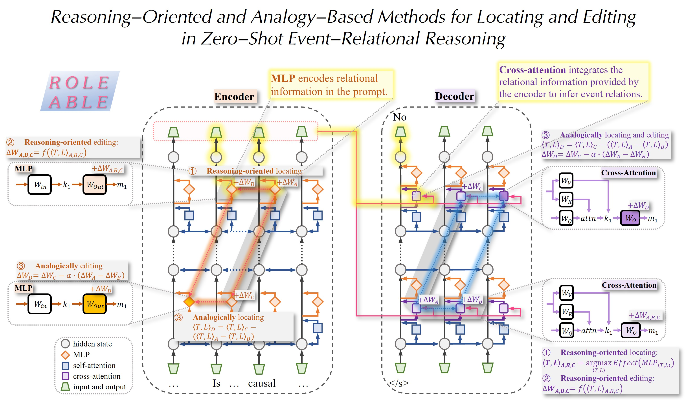

# Reasoning-Oriented and Analogy-Based Methods for Locating and Editing in Zero-Shot Event-Relational Reasoning (ROLE and ABLE)

This repository contains the implementation for the research work published at **COLING 2025** (The 31st International Conference on Computational Linguistics).
https://aclanthology.org/2025.coling-main.181/

<!-- [](https://colab.research.google.com/github/kmeng01/memit/blob/main/notebooks/memit.ipynb) -->



## Table of Contents

- [ROLE](#ROLE)
- [ABLE](#ABLE)

## ROLE
### Reasoning-oriented locating method（推理导向的定位）
```
python ./experiments/ROLE_locating_(...)No_ext.py
python ./experiments/ROLE_locating_(...)NoW_No_cla.py
python ./experiments/ROLE_locating_(...)NoW_No_ext.py
python ./experiments/ROLE_locating_(...)W_cla.py
python ./experiments/ROLE_locating_(...)W_ext.py
python ./experiments/ROLE_locating_(...)W_Yes_cla.py
python ./experiments/ROLE_locating_(...)W_Yes_ext.py
```
该代码用于计算特定任务（因果、时序和子事件的分类和抽取）对特定样本在特定位置（网络层数，token位置）的因果效应值，来进行推理导向的定位。
另外，
括号(...)：填入causal、subevent或者temporal；
cla和ext：分别表示分类和抽取任务；
(...)W：表示True Positive样本中，Yes的预测概率变化；
(...)W_Yes：表示False Positive样本中，Yes的预测概率变化；
(...)No：表示True Negative样本中，No的预测概率变化；
(...)NoW_No：表示False Negative样本中，No的预测概率变化。

Analyze locating results:
```
python ./experiments/ROLE_results_analysis.py
python ./experiments/ROLE_results_analysis_chinese.py
```
该代码用于整体分析6种任务在不同（网络层数，token位置）下的因果效应值，实现推理导向的定位：
对于论文中的图3：选择“T5-Encoder画图, 热力图”部分的代码；
对于论文中的图4，选择“T5-Decoder画图, 折线图”部分的代码。

### Reasoning-oriented editing method（推理导向的编辑）
以下代码用于推理导向的编辑，编辑T5的编码器和解码器，来实现对特定任务的优化。
For encoder's MLP module （编辑编码器的MLP模块）:
```
python ROLE_editing_encoder.py
```
For decoder's Cross-attention module （编辑解码器的交互注意力模块）:
```
python ROLE_editing_decoder.py
```

## ABLE （基于类比的定位和编辑方法）
```
python ABLE_causal_ext.py  # 用于事件因果关系抽取的数据集
python ABLE_causal_cla.py  # 用于事件因果关系分类的数据集
python ABLE_subevent_ext.py  # 用于子事件关系抽取的数据集
```
Analysis of the analogicality of location （分析关键位置的可类比性）
```
python ./experiments/ABLE_anal_location.py
```
Analysis of the analogicality of editing magnitude （分析编辑幅度的可类比性）
```
python ABLE_anal_edit.py
```

## 模型保存
ABLE_para_store中保存的模型：https://drive.google.com/drive/folders/1E2RtfE5l6xGL41rWgY443_j5vsut_uQi?usp=drive_link
